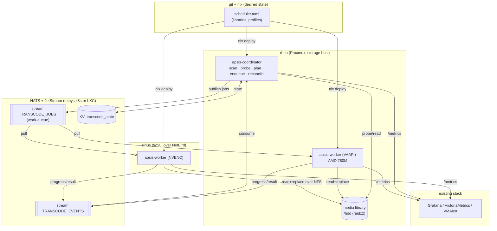
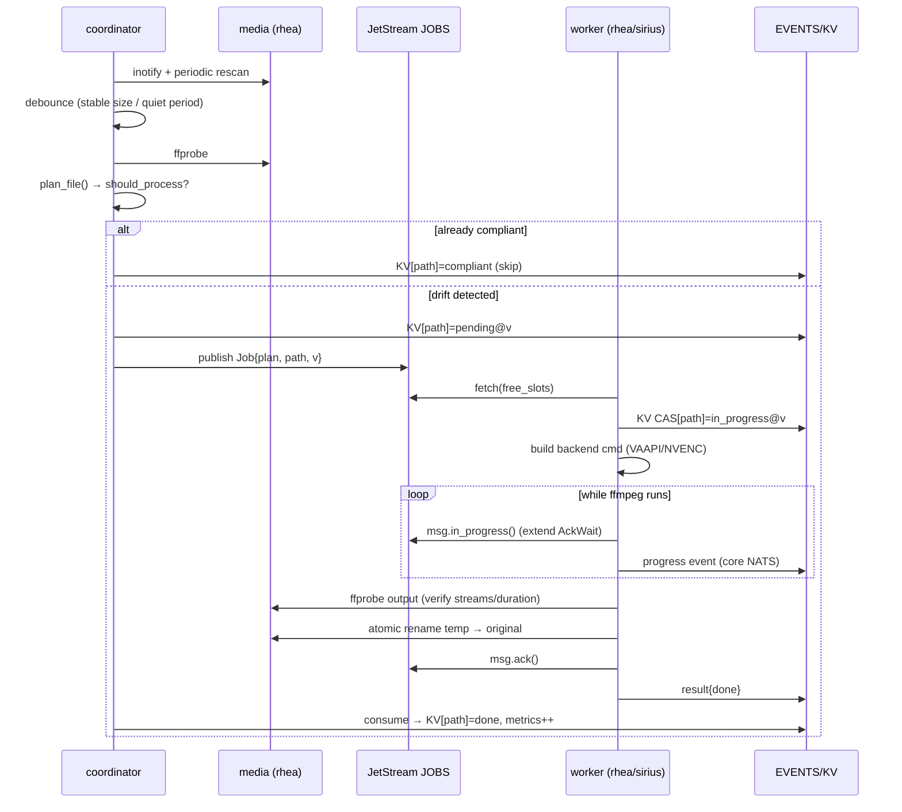

# apsis — Thin Distributed Transcode Scheduler (Rust) — Design

**Status:** Draft / design only. **Not implemented.** Production stays on
Unmanic + the `pyflows_transcode` plugin for now. This documents the design we
would build *if/when* Unmanic's friction (Python deploy gotchas, settings in
SQLite vs. git-recoverability, weak distributed workers) outweighs the cost of
owning the orchestration.

**Date:** 2026-08-14
**Name:** project **`apsis`** — an *apsis* is a key point of an orbit
(apo-/peri-apsis); the central-coordinator + orbiting-workers topology mirrors it,
and it fits the homelab's orbital naming (moons, `orbiit.xyz`). Binaries
`apsis-coordinator` (a.k.a. `apsisd`) and `apsis-worker`; shared library crate
`apsis-engine`; workspace also `apsis-common`. Crate name verified free on
crates.io (2026-08-16). Supersedes the retired `pyflows` daemon; the current
Unmanic plugin `pyflows_transcode` becomes `apsis_transcode` at cutover.

---

## 1. Why this exists

The "modern Unmanic" alternatives are not FOSS: **Tdarr** is closed (proprietary
EULA, freemium GPU nodes) and **FileFlows'** application source is **not published
at all** (only community scripts/packaging repos exist). **Unmanic (GPLv3) is the
only truly-FOSS orchestrator in this space.** So there is no off-the-shelf FOSS
upgrade path — the only alternative to Unmanic is to build our own.

The valuable IP we already own is the **engine** (`_engine/`: probe → plan →
ffmpeg-command, ~1700 lines, tuned to this hardware, including the AMD 780M
`sei=hdr` a53_cc workaround). Unmanic only provides the *shell* around it:
scanner, queue, worker pool, replace-original, and a web UI.

The insight that makes a rewrite tractable: **we already have the UI/history
problem solved** by Grafana + VictoriaMetrics + logs. We delete Unmanic's
biggest chunk (dashboard/history/DB) and replace it with metrics we already
scrape. What remains is small and bounded.

### Design principles

- **Declarative & git-recoverable.** The whole desired state lives in a TOML file
  in git, deployed via nix. Runtime state (NATS streams/KV) is a *cache*, always
  re-derivable from the config + the media library. Losing it costs a rescan, not
  data. (Matches the homelab "reconstruct everything from git" rule.)
- **Single static binary per role.** No vendored Python deps, no `site-packages`
  bundle, no interpreter — kills the entire class of Unmanic deploy gotchas.
- **Reconcile loop, not a job runner.** The config is *desired state*; the media
  library is *actual state*; the coordinator is a reconciler (Kubernetes-style).
  Re-running is idempotent and self-healing — it only ever acts on drift.
- **Thin.** Reuse crates for every hard part (async runtime, job queue, pub/sub,
  config). We write the glue and port the engine — nothing else.

---

## 2. Goals / Non-goals

### Goals
- Watch libraries, decide what needs transcoding (via the engine's plan), and run
  it across **distributed GPU workers**: rhea (VAAPI/AMD 780M) + sirius/WSL (NVENC).
- Backend-agnostic jobs: the same abstract plan runs on VAAPI *or* NVENC; each
  worker materializes the ffmpeg command for its own hardware.
- Durable queue with retries, crash-safe redelivery, and a dead-letter path.
- Atomic, verified replace-original (never corrupt the library).
- Observability entirely through the existing stack (Prometheus metrics → the
  VictoriaMetrics hub → Grafana; structured logs → journald/VictoriaLogs; alerts
  → VMAlert). **No bespoke web UI.**
- Full recoverability: config + nix reconstruct everything; a cold start with an
  empty NATS re-derives all work from a rescan.

### Non-goals
- No web UI / no on-the-fly (Jellyfin-style) transcoding — this optimizes a
  library at rest.
- Not a general ffmpeg workflow engine (no visual node graph). Profiles are the
  extent of configurability.
- Single coordinator; **not HA.** The coordinator is stateless-ish (state in NATS
  KV) and cheap to restart, so we accept a brief outage over the complexity of
  leader election.
- Workers trust the coordinator's plan; they don't re-plan (they only re-probe
  the output to verify).

---

## 3. Architecture



### Roles

| Role | Count | Runs on | Responsibility |
|------|-------|---------|----------------|
| **coordinator** | 1 | rhea LXC (near storage, for cheap probing) | scan → debounce → probe → plan → enqueue; consume result events; own KV state; expose metrics; reconcile on a timer |
| **worker** | 1 per GPU host | rhea (VAAPI), sirius (NVENC) | pull jobs; materialize backend ffmpeg command; run + progress-ack; verify + atomic replace; publish result |
| **NATS/JetStream** | 1 | tethys (k8s) *or* dedicated LXC | durable work-queue, event stream, KV state store, service transport |
| **engine** (`apsis-engine` crate) | lib | linked into coordinator (plan) + worker (command) | port of `_engine/`: probe, plan (abstract), backend command builders |

**Why the coordinator probes (not the workers):** probing reads the file to
decide skip-vs-process and to compute the abstract plan. Doing it once,
centrally, keeps the decision logic in one place and keeps workers dumb. The
coordinator sits on rhea next to the storage, so probing is local I/O. The job
payload carries the *abstract* plan; the worker only turns it into ffmpeg args
for its backend.

**The plan/command split maps directly onto the existing engine:**
`plan.py` (abstract: "encode video→hevc@qp22, HDR copy; audio tracks …; subs …")
is coordinator-side and backend-neutral. `command.py` (backend-specific:
`hevc_vaapi -sei hdr` vs `hevc_nvenc`) is worker-side. This is why the a53_cc
`sei=hdr` workaround lives only in the VAAPI backend.

---

## 4. NATS / JetStream protocol

One tiny FOSS server (Go binary, nix-packaged, Apache-2.0) gives us a durable
work-queue, pub/sub, request/reply, and a KV store — no other stateful service.

### Streams & KV

| Object | Type | Subjects | Retention | Purpose |
|--------|------|----------|-----------|---------|
| `TRANSCODE_JOBS` | Stream | `jobs.transcode.normal`, `jobs.transcode.priority` | **WorkQueue** (msg removed on ack) | the queue; each job delivered to exactly one worker |
| `TRANSCODE_EVENTS` | Stream | `events.job.>` | Limits (e.g. 7 d / N MB) | durable terminal results (for coordinator reconcile + audit) |
| `transcode_state` | KV bucket | key = file path | history=few | per-file status/version; dedup + observability |
| `workers` | KV bucket (optional) | key = worker id | TTL heartbeat | liveness/capacity; mostly obviated by pull model |

Progress updates are **core NATS** (ephemeral, non-persistent) on
`events.job.<id>.progress` — losing a progress ping is harmless. Only terminal
results go to the JetStream `TRANSCODE_EVENTS` stream.

### Consumers

- Workers create a **durable pull consumer** on `TRANSCODE_JOBS` with
  `AckPolicy=Explicit`, `MaxAckPending = max_concurrency`, and a filtered subject
  if pinned (see routing). Each worker `fetch(batch = free_slots, expires=…)` —
  **pull-based ⇒ automatic load-balancing** across rhea+sirius by real capacity.
- The coordinator has a durable consumer on `TRANSCODE_EVENTS` to fold results
  into KV + metrics.

### Job routing (VAAPI vs NVENC)

Both backends can encode anything, so the default is a **single shared queue,
any-worker-pulls** — the freest GPU grabs the next job. Pinning is the exception:

- Backend pin (rare): publish to `jobs.transcode.normal` with a header
  `Apsis-Require-Backend: vaapi`; a worker whose backend differs `nak`s it back
  for another worker. (Simpler than per-backend streams; revisit if it causes
  nak churn, then split into `jobs.transcode.vaapi` / `.nvenc` filtered consumers.)
- Priority: `jobs.transcode.priority` drained before `.normal` by ordering the
  worker's fetch (priority consumer first).

### Delivery semantics (the important part)

Transcodes can run for **hours**, far longer than any sane `AckWait`. So:

1. Worker `fetch`es a job (msg becomes unacked; `AckWait` e.g. 60 s starts).
2. Worker writes `state[path] = in_progress@version` (KV, compare-and-set on
   version to avoid a double-take across a redelivery race).
3. While ffmpeg runs, the worker sends **`msg.in_progress()`** (AckProgress) every
   `AckWait/2` — this *extends* the deadline without acking. A crashed worker
   stops sending → `AckWait` lapses → JetStream redelivers to another worker.
4. On success: `msg.ack()` (removed from the work-queue). On a handled failure:
   `msg.nak(delay)` with exponential backoff + jitter, up to `MaxDeliver`.
5. On `MaxDeliver` exhaustion: `msg.term()` and publish to a **dead-letter**
   subject `events.job.<id>.dead` → VMAlert fires. Poison jobs never loop forever.

**Guarantee:** at-least-once delivery + idempotent execution. Re-running a job on
an already-compliant file is a no-op (the engine's `should_skip` short-circuits on
re-probe), so a duplicate delivery cannot double-transcode or corrupt anything.

### Message schemas (JSON — chosen for debuggability; MessagePack/CBOR later if size matters)

**Job** (`jobs.transcode.*`):
```json
{
  "job_id": "01J…ULID",
  "path": "/hdd/tv-shows/Show/S01E01.mkv",
  "mtime": 1723600000,
  "size": 3221225472,
  "profile": "tv-shows",
  "plan": { "…": "the abstract FilePlan (video/audio/subtitles/output)" },
  "enqueued_at": "2026-08-14T10:00:00Z",
  "attempt": 1
}
```

**Progress** (core NATS, `events.job.<id>.progress`, ~1/s):
```json
{ "job_id": "01J…", "worker": "rhea", "backend": "vaapi",
  "out_time_s": 812.4, "speed": 21.3, "fps": 511 }
```

**Result** (JetStream, `events.job.<id>.result`):
```json
{ "job_id": "01J…", "worker": "rhea", "backend": "vaapi",
  "status": "done", "in_bytes": 3221225472, "out_bytes": 1288490188,
  "duration_s": 168.2, "used_fallback": false, "error": null }
```
`status ∈ {done, skipped, failed}`. `used_fallback=true` when VAAPI failed and the
worker fell back to CPU (libx265).

---

## 5. Job lifecycle



Failure branches: VAAPI ffmpeg non-zero → worker retries with CPU backend
(`used_fallback`); still failing → `nak` (backoff) → redelivery → after
`MaxDeliver`, `term` + dead-letter + alert. Worker crash mid-encode → `AckWait`
lapses → redelivery to a peer; the partial temp file is discarded (never renamed).

---

## 6. Declarative config (TOML)

Two files, deliberately split by *what* vs *how-on-this-box*:

- **Central config** (`scheduler.toml`, in git, deployed to the coordinator):
  libraries, profiles, NATS coordinates, scan behavior. Hardware-neutral.
- **Worker-local config** (`worker.toml`, per host): identity, available
  backends, device, concurrency, ffmpeg path, hardware env. Host-specific, so it
  does **not** belong in the shared profile config.

### Central `scheduler.toml`

```toml
[coordinator]
scan_interval   = "15m"     # full rescan cadence (belt to inotify's suspenders)
debounce        = "2m"      # ignore files whose size changed within this window
                            # (Sonarr/Radarr still writing). Unmanic has NO such
                            # check in core (unimplemented TODO, taskhandler.py:116);
                            # it's an opt-in plugin there. We bake it into core.

[nats]
url         = "nats://nats.homik.xyz:4222"
creds_file  = "/run/secrets/apsis-nats.creds"   # sops-provisioned
jobs_stream = "TRANSCODE_JOBS"
kv_bucket   = "transcode_state"
ack_wait    = "60s"
max_deliver = 5

# --- libraries: path → profile (longest matching path wins, as today) ---
[[library]]
name       = "tv-shows"
path       = "/hdd/tv-shows"
profile    = "tv-shows"
extensions = ["mkv", "mp4", "avi", "m4v", "ts"]

[[library]]
name    = "anime"
path    = "/hdd/anime"
profile = "anime"

# --- profiles (the desired end-state per library) ---
[profiles.tv-shows.video]
codec       = "hevc"        # hevc | av1
quality     = 22            # QP/CRF (0–51)
prefer      = ["vaapi", "nvenc"]   # backend preference order; workers offer what they have
fallback    = "cpu"         # cpu | none  (VAAPI→libx265 on failure)
skip_codecs = ["hevc"]      # already-target → copy (no re-encode)
hdr_policy  = "copy"        # copy | tonemap | encode  (copy = don't re-encode HDR)

[profiles.tv-shows.audio]
keep_languages    = ["eng", "spa"]
default_language  = "eng"
priority          = ["eng", "spa"]
remove_commentary = true
preserve_surround = true
[profiles.tv-shows.audio.add_stereo]
codec     = "aac"
bitrate   = 128
channels  = 2
languages = ["eng", "spa"]

[profiles.tv-shows.subtitles]
keep_languages    = ["eng", "spa"]
default_language  = ""
remove_formats    = ["pgs", "dvd_subtitle"]   # image subs
remove_commentary = true

[profiles.tv-shows.output]
container        = "mkv"
replace_original = true

# [profiles.anime.*] … same shape, anime-tuned
```

This is a 1:1 declarative mirror of today's `_engine/config.py` (pydantic) models,
validated at load with **`garde`** derives (e.g. `quality ∈ 0..=51`, every
`library.profile` exists). `schemars` can emit a JSON-Schema for editor
validation. Env expansion (`${VAR}`) via a tiny helper, as today.

### Worker-local `worker.toml`

```toml
[worker]
id              = "rhea"
max_concurrency = 1          # AMD VCN HEVC encode is single-session (see GOTCHAS)
ffmpeg          = "/usr/lib/jellyfin-ffmpeg/ffmpeg"
ffprobe         = "/usr/lib/jellyfin-ffmpeg/ffprobe"

[[worker.backend]]
kind          = "vaapi"
device        = "/dev/dri/renderD128"
hw_env        = { AMD_DEBUG = "noefc" }
hw_decode     = ["hevc", "av1", "vp9"]   # SW-decode everything else (e.g. h264)
sei_workaround = true        # emit `-sei hdr` (drop a53_cc) — the 780M bug fix

# sirius/worker.toml would instead declare:
#   [[worker.backend]] kind = "nvenc"  device = "0"  (no sei workaround needed)
```

Hardware truth lives here, next to the box. The coordinator's plan says *"encode
to hevc@qp22, HDR copy"*; each worker's backend decides *how* (VAAPI + `sei=hdr`
+ HW/SW decode split, or NVENC + nvdec).

---

## 7. State, idempotency, reconciliation

- **Desired state** = libraries × profiles (from git). **Actual state** = the
  files on disk. The coordinator diffs them (`plan_file` → `should_skip`) and only
  enqueues drift. This is a **reconcile loop**: safe to run anytime, converges,
  self-heals.
- **KV `transcode_state`**, key = file path, value =
  `{status, version=mtime:size, job_id, updated_at}`. Uses:
  - **Dedup:** don't re-enqueue a `pending`/`in_progress` file whose version is
    unchanged.
  - **Change detection:** a new `mtime:size` supersedes prior state → re-evaluate.
  - **Observability/history** without a separate DB.
- **Natural idempotency:** after a transcode, replace-original rewrites the file;
  the next scan re-probes and finds it compliant → `skip`. So even a total KV loss
  only costs one redundant probe pass, never a re-transcode of compliant media.
- **Cold start / KV wiped:** coordinator rescans, re-derives desired vs actual,
  re-enqueues only true drift. Nothing to restore. (This is the recoverability
  guarantee in practice.)

---

## 8. Worker execution detail (the replace-original half Unmanic owned)

This is the `run/verify/replace` half that `pyflows` (the retired daemon) used to
do and that moved to Unmanic — it comes home into the worker:

1. Build ffmpeg command for the chosen backend from the abstract plan.
2. Run via `tokio::process`, writing to a **temp file on the same filesystem** as
   the source (so the final `rename` is atomic).
3. Parse ffmpeg progress (`-progress pipe:` → out_time/speed/fps) → progress events.
4. VAAPI backend: on non-zero exit, retry once with the CPU encoder (libx265);
   record `used_fallback`.
5. **Verify** the output with ffprobe: expected streams present, duration within
   tolerance, not truncated, output smaller-or-sane. Fail → discard temp, `nak`.
6. **Atomic replace:** `rename(temp, original)` (or write beside + swap), then
   preserve `stat(2)` (mtime/owner/perms) onto the new file. Unmanic's **core does
   not** preserve stats (plain `shutil.copyfile`, `postprocessor.py:435`); it's a
   stock plugin there. We bake it into core so library indexers see files correctly.
7. Publish the result event; `ack`.

Never mutate the original until step 6. A crash at any earlier step leaves the
library untouched.

---

## 9. Observability (replaces the Unmanic UI)

- **Metrics** (`metrics` + a Prometheus exporter endpoint per binary, scraped by
  vmagent → the VictoriaMetrics hub):
  - `apsis_queue_depth`, `apsis_jobs_inflight{worker}`,
  - `apsis_transcode_duration_seconds`, `apsis_transcode_speed_x{backend}`,
    `apsis_encode_fps{backend}`,
  - `apsis_jobs_total{status=done|skipped|failed}`,
    `apsis_fallback_total{worker}`,
  - `apsis_bytes_in`/`apsis_bytes_out` (space saved),
  - `apsis_worker_up{worker}` (heartbeat).
- **Logs:** `tracing` structured JSON → stdout → journald (→ VictoriaLogs if we
  ship them). One span per job (`job_id`) ties progress/result together.
- **Dashboards:** a Grafana dashboard = the replacement for Unmanic's UI (queue,
  throughput, per-worker/per-backend speed, failures, space reclaimed).
- **Alerts (VMAlert):** worker down (`absent`/heartbeat gap), queue stuck (depth
  flat + zero completions), failure-rate spike, any dead-letter event.

---

## 10. Deployment

| Component | Placement | How | Reachability |
|-----------|-----------|-----|--------------|
| NATS/JetStream | **tethys k8s** (Deployment+Service+PVC) *or* a small LXC on rhea | nix/Flux; one Go binary | LAN for rhea; **NetBird** for sirius/WSL |
| coordinator | rhea LXC (near `/hdd`) | nix module + systemd; static binary | reads media locally; talks NATS over LAN |
| worker (VAAPI) | rhea (same or sibling LXC with `/dev/dri`) | nix + systemd | LAN |
| worker (NVENC) | sirius/WSL | nix-built binary + service; media via the existing **rhea NFS export**; NATS over NetBird | NetBird |
| config | git (this repo) → sops for `nats.creds` → nix | — | — |

**NATS placement trade-off:** on tethys it's declarative/GitOps and monitored, but
adds a cross-host dependency (rhea+sirius must reach it). On a rhea LXC it's next
to storage + the always-on host, fewer moving parts, but managed like the DNS
LXCs (less git-native). *Lean: start on a rhea LXC (simplest, co-located with the
coordinator + primary worker); move to k8s if we want it GitOps-managed.*

**Security:** NATS with TLS + per-role credentials (NKEY/JWT), creds via sops
(`apsis-nats.creds`), subject-level permissions (workers may only
consume `jobs.>` and publish `events.>`; coordinator owns the streams/KV).
Reconnect with **exponential backoff + jitter** (per the repo networking rule).

---

## 11. Recoverability audit (the homelab non-negotiable)

| Thing | Lives in | On total loss |
|-------|----------|---------------|
| Profiles, libraries, scan/ack settings | git (`scheduler.toml`) | `git checkout` |
| Worker hardware config | git (`worker.toml`) | `git checkout` |
| Binaries | nix (reproducible build) | `nixos-rebuild` |
| NATS creds | sops | decrypt |
| Streams / consumers / KV state | **runtime (NATS)** | **re-derived by a rescan** — no restore needed |
| Transcoded media | the library itself | already the source of truth |

Nothing is "live-only." The only runtime state is a *cache* of a computation over
git-config + files, so a from-scratch rebuild (empty NATS) converges to the same
result on the next reconcile.

---

## 12. Crate stack (verified 2026-08-14)

| Concern | Crate | Notes |
|---------|-------|-------|
| Async runtime | `tokio` | tasks, `process`, `sync::{mpsc,Semaphore}` |
| Job queue / pub-sub | **`async-nats` 0.50** | official client, 45M downloads; JetStream + KV + core |
| (alt, single-node) durable queue | `apalis` 1.0.0-rc.9 | SQLite/Redis backends, retries, cron — for a rhea-only phase without NATS. *Pin exactly (pre-1.0).* |
| Config | `serde` + `toml` + `figment` | **not `serde_yaml`** (archived 2024); figment layers file+env+defaults |
| Validation | `garde` | derive-based (ranges, cross-refs) — replaces pydantic |
| Config schema | `schemars` | JSON-Schema for editor validation |
| DB (if used beyond KV) | `sqlx` | SQLite, compile-checked queries |
| Logs | `tracing` + `tracing-subscriber` | structured spans per job |
| Metrics | `metrics` + `metrics-exporter-prometheus` | scraped by vmagent |
| IDs | `ulid` | sortable job ids |
| Filesystem watch | `notify` | inotify + fallback |

**No broker at all** is viable for a rhea-only first phase: `tokio` + `apalis`
(SQLite backend) gives a durable local queue with retries. NATS enters only when
sirius joins (distributed transport).

---

## 13. Rollout (coexist with Unmanic, then cut over)

1. **Extract the engine** into a `apsis-engine` Rust crate (port `probe`,
   `plan`, `audio`, `subtitles`, `command`). ~1700 lines of pure logic + existing
   tests as the oracle. Interim option: shell out to the current Python engine to
   de-risk, but the single-binary goal wants the port.
2. **Phase 1 — rhea only, no NATS.** Coordinator + one VAAPI worker in-process,
   `apalis`/SQLite queue. Run against **one test library** in parallel with
   Unmanic (which keeps prod). Compare outputs.
3. **Phase 2 — distributed.** Introduce NATS JetStream; add the sirius NVENC
   worker over NetBird. Shadow prod libraries (dry-run: plan + metrics, no
   replace) to validate decisions match Unmanic.
4. **Cutover.** Point prod libraries at the scheduler; retire the
   `pyflows_transcode` Unmanic plugin. Keep Unmanic installable as a fallback
   until a few cycles pass clean.

---

## 14. Open questions

- **NATS home:** rhea LXC (simple, co-located) vs tethys k8s (GitOps/monitored).
  Leaning LXC first.
- **Engine port vs FFI:** full Rust port (single binary, the goal) vs calling the
  Python engine via a subprocess for a while (faster to a working system).
- **Anime → dedicated worker/params:** today anime is just a different *profile*;
  if anime needs a different *backend/host*, express it as a backend pin
  (`Apsis-Require-Backend`) or a `jobs.transcode.anime` filtered consumer.
- **CC recovery:** the parked `_RECOVER_CC` ASS-extraction step ports as an
  optional pre-pass on the worker (VAAPI backend only, since `sei=hdr` is what
  drops the CC).
- **Backpressure to Sonarr/Radarr:** none needed (pull model self-limits), but a
  max-queue-depth alert is worth having.

---

## Appendix A — Prior art: what Unmanic already solved (studied 2026-08-14)

We read the Unmanic (GPLv3) core (~4600 lines: `foreman`, `workers`, `taskqueue`,
`task`, `taskhandler`, `postprocessor`, `libraryscanner`, `eventmonitor`,
`filetest`, `library`, `installation_link`, `history`). Headline: Unmanic's own
distributed mode **already validates our NFS-shared + reference-not-transfer
approach**, and most of its complexity is machinery we don't need. Its real gaps
(no task lease, no in-flight debounce, no output verification, no stat
preservation, no rollback) are exactly what our design fixes.

### The key validation — Unmanic's "shared path" mode

`installation_link.py:1393-1421`: when the library path is **shared (NFS/SMB)**,
Unmanic creates the remote task with a **relative path reference and uploads
nothing**. It only does multipart upload + MD5 + transfer-throttling when the path
is **not** shared (`:1423-1463`). Our rhea+sirius design runs **100% in that
shared-path regime** (NFS everywhere), so JetStream carries only job metadata and
we inherit none of the transfer cost.

### Discard — machinery Unmanic needs but we don't

| Unmanic mechanism | Where | Why we skip it |
|---|---|---|
| HTTP multipart file upload/download | `installation_link.py:1423-1463` | NFS-shared media — workers read/write in place |
| MD5 checksum on every transfer | `installation_link.py:1424-1462` | no transfer to corrupt |
| Per-remote network transfer lock (max 5; >100 MB serial) | `installation_link.py:135-174` | no transfer to throttle |
| 5 s HTTP polling of remote task status | `installation_link.py:1507-1555` | JetStream push + `in_progress` heartbeats |
| Per-remote-task manager thread | `installation_link.py:1183-1723` | JetStream consumer + result events |
| Bidirectional link-config sync (latest-timestamp-wins) | `installation_link.py:414-568` | one git config is the source of truth |
| `distributed_worker_count_target` push | `installation_link.py:597-627` | pull model self-balances; per-worker `max_concurrency` in config |

### Adopt — patterns worth copying (with citations)

| Pattern | Where | Take-away for us |
|---|---|---|
| Per-task isolated cache dir (`random+timestamp`) | `task.py:95-102` | same, keyed by ULID job_id |
| Two-phase move via visible `.part` suffix | `postprocessor.py:431-447` | write temp on same FS → verify → atomic rename; `.part` is nice for observability |
| Source removed **only** after success flag | `postprocessor.py:269-275` | never delete original until verified rename done |
| Process-**tree** kill, SIGTERM→SIGKILL w/ deadlines | `workers.py:216-269` | replicate in Rust (`nix` + process group); ffmpeg spawns children |
| Composite priority `id + library_score + score` | `task.py:238` | dynamic boost without reordering the queue |
| Failed-file **blacklist** from history | `filetest.py:69-85` | don't re-queue a file that always fails |
| Sequential inotify processing (anti double-add) | `eventmonitor.py:252-253` | our KV CAS covers it; still process events serially |
| Full ffmpeg stdout/stderr captured per task | `history.py:278-281` | attach the command + stderr to the **result/dead-letter** event for debugging |
| `.unmanicignore` opt-out lockfile | `filetest.py:87-105` | optional `.apsisignore` for per-dir opt-out |
| `enable_remote_only` per-library | `libraryscanner.py:159-161` | a library flag to pin work to a specific worker/host |
| Edge cases: symlink dedup, unicode-safe paths, library-deleted-mid-scan, config hot-reload | `libraryscanner.py:235-263`, `filetest.py:240-241` | fold into the scanner |

### Improve — Unmanic's gaps that our design already closes

| Gap in Unmanic | Where | Our fix |
|---|---|---|
| **No task lease/TTL** → a crashed worker leaves a task `in_progress` forever | `taskqueue.py:227-242` (no timeout) | JetStream `AckWait` + `in_progress()` heartbeats → auto-redelivery |
| **No in-flight debounce** (unimplemented TODO) | `taskhandler.py:116-117` | `debounce` (size-stability) in core |
| **Dedup by absolute path only** (no mtime/hash) | `taskhandler.py:150-160` | KV keyed by `path` + `mtime:size` version → detects replaced files |
| **No output verification** before replace (ffprobe/size) | `postprocessor.py:196-198` (delegated to plugins) | worker ffprobes output (streams/duration) before rename |
| **No stat preservation** in core (owner/mtime/perms) | `postprocessor.py:435` | baked into the worker's replace step |
| **No rollback / `.part` cleanup on failure** | `postprocessor.py:408-428` | worker discards temp on any failure; nothing half-written survives |
| **Sequential multi-pass** (one ffmpeg per plugin) | `workers.py:744-944` | single-pass via the engine (already true today in `pyflows_transcode`) |
| **ffmpeg progress = bareword-float plugin callback** | `workers.py:346-377` | `-progress pipe:` (key=value: out_time/speed/fps) as the default parser |

### Optional features Unmanic has that we deferred

- **Pause/schedule windows** (cron-like) + OS-level process **suspend** (`psutil.suspend`, tracking paused time): `foreman.py:197-246`, `workers.py:156-196`. Worth adding later as a coordinator "quiet hours" that stops handing out jobs (simpler than suspending running ffmpeg).
- **Runtime worker-count change without restart** (DB-backed): `foreman.py:194-195`. Our pull model + a re-readable `worker.toml` (SIGHUP reload) covers the intent.

---

## Appendix B — FileFlows: black-box architecture study (public sources, 2026-08-16)

Studied **only** from public materials — the docs site (`fileflows.com/docs`,
`docs.fileflows.com`) and the **open** `fileflows/community-repository` — **no
decompilation, no internals**. FileFlows is closed-source; we take **concepts (the
"what"), never implementation**, which keeps apsis's MIT provenance clean (see
below).

### Architecture, as publicly documented

- **Server + Nodes.** The **Server** is the main app and ships with a built-in
  processing node (self-sufficient). Extra **Nodes** connect to the Server for
  **distributed processing** across machines.
- **Per-node knobs:** **runner count** (= simultaneous files = concurrency),
  **priority** (higher favored first), and a **schedule** (out-of-schedule nodes
  are skipped). The Server hands files to the highest-priority available node.
- **Path mapping:** flow/library paths are **mapped Server→Node** to locally
  available paths; each node has its own temp dir the server never touches.
- **Config distribution:** a node keeps a **local (encrypted) copy** of the central
  config (flows, libraries, plugin settings) and processes from it.
- **Node-based flow graph:** a file enters a **Flow** (a graph of connected **flow
  elements**) and branches through operations; flows monitor libraries.

### Extensibility — a *layered* model (directly informs our plugin debate)

FileFlows has **no single plugin system** — it has **five tiers**, heavy→light:
1. **Plugins** (.NET, compiled) — big capabilities / new flow elements.
2. **Scripts** (JavaScript) — **Flow** (strict I/O contract, run inside a flow),
   **System** (scheduled or pre-execute on a node, no I/O), **Shared** (importable).
3. **SubFlows** (JSON) — reusable sub-graphs (e.g. `HEVC AC3 Encode.json`).
4. **Function** node — inline JS for one-offs.
5. **DockerMods** (shell) — **runtime tool provisioning**: a node installs what a
   flow needs (FFmpeg builds, GPU drivers `AMDVLK & AMF`, Calibre, ImageMagick,
   `AutoCRF`, …) instead of shipping one fat image.

### Lessons for apsis — adopt / adapt / skip

**Adopt (concepts):**
- **Per-node priority + schedule + runner-count** → into `worker.toml` (we have
  concurrency; add `priority` and an optional `schedule`).
- **Explicit per-node path mapping** → a `[path_map]` in `worker.toml` (sirius/WSL
  mount ≠ rhea path). Identity on rhea, real on sirius.
- **The layered-extensibility insight** confirms our earlier call: *if* apsis ever
  needs extensibility, the **light tiers** — an embedded-script tier (Rhai/Lua ≈
  FileFlows "Scripts") + composable **sub-profiles** (≈ SubFlows) — deliver most of
  it **without** a compiled-plugin ABI. Compiled plugins are the heavy last resort.
- **AutoCRF** → a profile mode that **targets a quality metric (VMAF)** and derives
  QP/CRF, instead of a fixed QP. Optional future `quality = { target_vmaf = 95 }`.

**Adapt (we do it more declaratively):**
- **Config distribution:** FileFlows pushes an encrypted config copy to nodes at
  runtime; **we ship it via git + nix** — same idea, better recoverability/provenance.
- **DockerMods (runtime tool install):** we provision per-worker toolchains
  (jellyfin-ffmpeg, VAAPI vs NVENC drivers) via **nix per host** — reproducible
  instead of runtime shell installs.

**Skip (product surface a homelab tool doesn't need — validates "thin"):**
- Web Console UI, **Forge** (flow/plugin marketplace), **FileDrop** (drop endpoint),
  Database Tool, built-in Auth, **License management**. apsis = Grafana + git.

### Provenance & licensing (apsis = MIT)

| Source | How used | Effect on apsis MIT |
|---|---|---|
| `apsis-engine` (port of our `_engine`) | our own Python → Rust | unencumbered — it's ours |
| **Unmanic (GPLv3)** | studied for **patterns/edge-cases** (ideas, not code); write **original** code, copy **no** GPL source | ideas/architecture aren't copyrightable → **no copyleft** on apsis |
| **FileFlows (closed)** | **public docs + open community-repo only** (black-box); **no decompilation** | nothing proprietary enters apsis |
| Crates (async-nats Apache-2.0; tokio/serde/notify… MIT) | dependencies | permissive, MIT-compatible |

Clean and defensible: apsis ships **MIT**, built from our own engine + original
orchestration, informed by *ideas* from an open GPL project and the *public*
surface of a closed one.

---

## 15. Bottom line

The coordination is **not** the hard part: `tokio` + `async-nats`/JetStream give
durable work-queue, retries, redelivery and pub/sub almost for free, and the
config is `serde` + `toml` + `garde`. The only real work we own is **the engine
(already written) + the glue**, and the UI — Unmanic's biggest cost — is deleted
by leaning on Grafana. That is what keeps this a *thin* scheduler and not a
second Unmanic. Build it only when Unmanic's friction is worth the port; the
design above is ready when that day comes.
```
